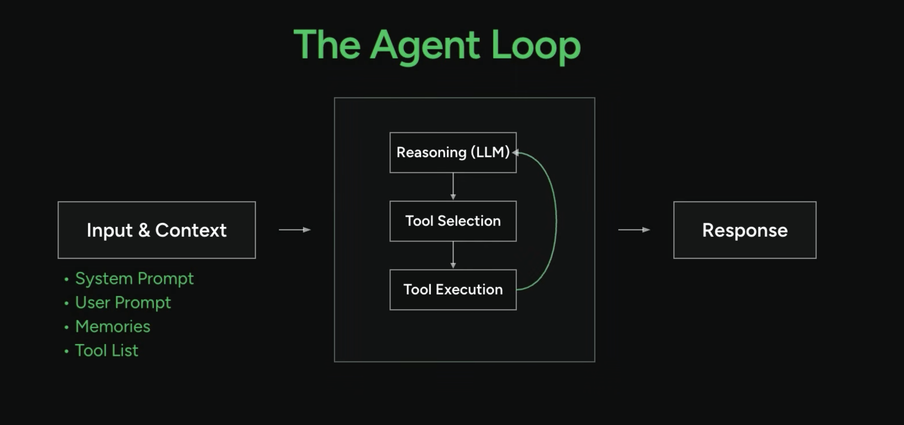

# **From API Calls to Agents:**

# **Popping the Hood on AI**

Roberto Allende

https://allende.nz/


---

<!-- _class: lead -->


---

<!-- _class: lead -->


---

<!-- _class: lead -->


<small>John Harrison’s first chronometer, weighed 35kg.</small>

----

<!-- _class: lead -->


---

<!-- _class: lead -->

```assembly
section .data
    msg db "Hello, world!", 0Ah
    len equ $ - msg

section .text
    global _start

_start:
    ; Write syscall
    mov rax, 1        ; system call 1 is write
    mov rdi, 1        ; file descriptor 1 is stdout
    mov rsi, msg      ; address of string
    mov rdx, len      ; length of string
    syscall           ; call operating system

    ; Exit syscall
    mov rax, 60       ; system call 60 is exit
    xor rdi, rdi      ; exit code 0
    syscall
```

----

<!-- _class: lead -->

```
Hello, World!
```

----

<!-- _class: lead -->

```python
def main() -> None:
    print("Hello, World!")


if __name__ == "__main__":
    main()
```

---

<!-- _class: lead -->

**Python is a deterministic language** under normal execution conditions. 

Like almost all general-purpose programming languages, if you provide a Python program with the exact same inputs and starting state, it will execute the exact same sequence of instructions and produce the exact same output.

---

<!-- _class: lead -->

# f(x) = x

*f(2) = 2, f(100) = 100*

---

<!-- _class: lead -->

```python
import sys

def f(x) -> None:
    print(x)

if __name__ == "__main__":
    f(sys.argv[1])
```


-----

<!-- _class: lead -->

# g(x) = x + x

*g(2) = 4, g(100) = 200*

----

<!-- _class: lead -->

```python
  import sys

  def f(x) -> None:
      print(x+x)

  if __name__ == "__main__":
      f(int(sys.argv[1]))
```


----

<!-- _class: lead -->

# chat(text)

| Input           | Output                                                  |
| --------------- | ------------------------------------------------------- |
| **hello**       | *hello, how are you?*                                   |
| **bye**         | *bye!, have a nice day.*                                 |
| *anything else* | *Beautiful weather, nothing beats Wellington on a nice day!* |

----

<!-- _class: lead -->

```python
import sys

def chat(text) -> str:
    lowered = text.lower()
    if "hello" in lowered:
        return "hello, how are you?"
    if "bye" in lowered:
        return "bye!, have a nice day."
    return "Beautiful weather, nothing beats Wellington on a nice day!"

if __name__ == "__main__":
    print(chat(sys.argv[1]))
```

----

<!-- _class: lead -->

```python
while True:
    text = input("> ")
    lowered = text.lower()

    if lowered == "/quit":
        break
    elif "hello" in lowered:
        print("hello, how are you?")
    elif "bye" in lowered:
        print("bye!, have a nice day.")
    else:
        print("Beautiful weather, nothing beats Wellington on a nice day!")
```

---

<!-- _class: lead -->

# chat(string) = another_string

*chat("hello") = "hello, how are you?"*

*chat("bye") = "bye!, have a nice day."*

----

<!-- _class: lead -->

```python
def chat(astring) -> str:
    request = network.Request(astring, configuration)
    return request.response() 

while True:
    text = input("> ")
    if text.lower() == "/quit":
        break
    print(chat(text))
```

----

<!-- _class: lead -->

Generative AI is non-deterministic because it uses probability and random sampling to pick the next word instead of following a strict, fixed rule.

---

<!-- _class: lead -->

# chatbot(string) = 🎲(string)

----

<!-- _class: lead -->

Let's play the cynic game. For anything I write, you answer with *"Yes, whatever.". Ok?*


----

<!-- _class: lead -->

# chat(string) = 

# 🎲(myapp_prompt + string)

*myapp_prompt = Let's play the cynic game. For anything I write, you answer with "Yes, whatever".* 

*chat("The weather is beautiful") = "Yes, whatever."*

*chat("I just won the lottery!") = "Yes, whatever."*

----

<!-- _class: lead -->

GenAI prompt engineering is the art and science of structuring, designing, and refining text or visual inputs to guide a generative artificial intelligence model toward producing the most accurate, useful, and relevant output.

---

<!-- _class: lead -->

### chat(string) = 🎲(string)  = m_1


---

<!-- _class: lead -->

### chat(string) = 🎲(string)  = m_1

### chat(string) = 🎲(m_1 + string)  = m_2


---

<!-- _class: lead -->

### chat(string) = 🎲(string)  = m_1

### chat(string) = 🎲(m_1 + string)  = m_2

### chat(string) = 🎲(m_2 + string)  = m_3

...

### chat(string) = 🎲(m_n + string)  = m_n+1


---

<!-- _class: lead -->

## Chatbot

- input -> output
- prompt
- memory


---

<!-- _class: lead -->

## Chatbot

- input -> output
- prompt
- memory
- *Loop*


---

<!-- _class: lead -->

```python
def chat(question) -> str:
    request = network.Request(astring, configuration)
    return request.response() 
  
def is_cynical(question, answer) -> str:
    return chat("Say true or false, Given " + question + "Is the following a very cynical answer: " + answer)
    
while True:
    text = input("> ")
    if text.lower() == "/quit":
        break
    output = chat("Give me a cynical answer for this: " + text)
    if (is_cynical(text, output)):
        print(output)
    else"
        print(chat("Give me a cynical answer for this: " + text))
```

---

<!-- _class: lead -->

```python
from strands import Agent
from strands.models.ollama import OllamaModel

model = OllamaModel(host="http://localhost:11434", model_id="llama3.2")
agent = Agent(model=model, callback_handler=None)

while True:
    text = input("> ")

    if text.lower() == "/quit":
        break

    answer = agent(text)

    print(answer)
    print()
```


---

<!-- _class: lead -->



<small>Morgan Willis / AWS Developers: How AI Agents Really Work</small>

---

<!-- _class: lead -->

A tool in agentic engineering is an external function or software capability that an AI agent can call to interact with the real world and complete tasks.

While a Large Language Model (LLM) alone can only generate text, giving it access to tools allows it to take actions, retrieve fresh data, and run code.


---

<!-- _class: lead -->

# Memory that survives restarts

The agent saves the conversation to `sessions.md` on exit, and reloads it on start — using an **MCP tool** to read and write the file.

----

<!-- _class: lead -->

```python
from strands.tools.mcp import MCPClient

mcp = MCPClient(...)

with mcp:
    previous = load_history()      # MCP read_document
    agent = Agent(model=model, system_prompt=base + previous)

    while True:
        text = input("> ")
        if text.lower() == "/quit":
            save_history(agent.messages)   # MCP write_document
            break
        print(agent(text))
```

---

<!-- _class: lead -->

# An agent with a job

Talks *only* about exercise. Say **"generate routine"** and it writes a **Fancy Kanban** week — one card per day: workout, rest, or match.

----

<!-- _class: lead -->

```python
@tool
def save_weekly_routine(agent: Agent) -> str:
   """Generate and save the user's weekly exercise routine for the whole week. 
   Reads the plan from the conversation so far and stores it as a Fancy Kanban
   board. Invoked when the user explicitly asks to generate or save the routine.
   """
   
   week = agent.structured_output( WeekPlan, 
          "Based on the conversation so far, produce the weekly exercise routine "
          "as structured data. Provide exactly seven days, Sunday through "
          "Saturday, each with a kind (Exercise, Rest, or Match) and a short "
          "activity label.")

	save_routine(render_kanban(week))
	return "The weekly routine has been saved."           # exercise-only chat
```

----

<!-- _class: lead -->

## Thank you very much
Roberto Allende

https://allende.nz/


----

<!-- _class: lead -->

# References 

- Longitude: The True Story of a Lone Genius Who Solved the Greatest Scientific Problem of His Time -  Dava Sobel
- Morgan Willis / AWS Developers: How AI Agents Really Work
- https://allende.nz